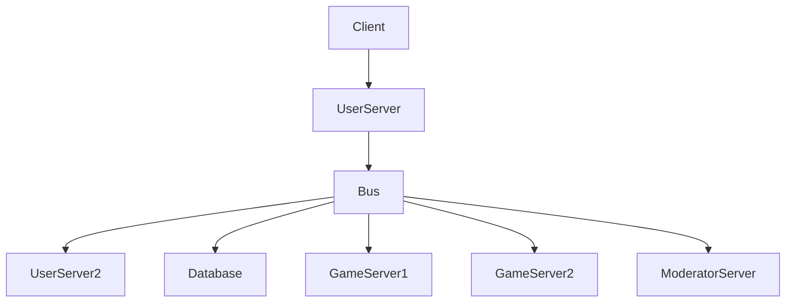
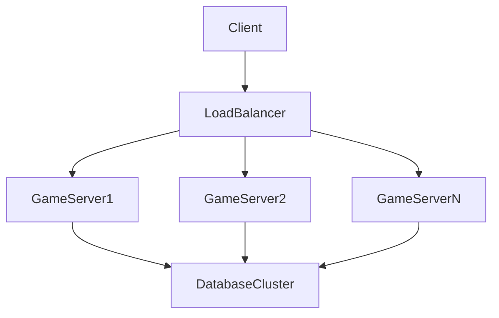

# Hardware Architectuur

## WoW

"Initial servert blueprint, May 2001":

A client is connected to a user server via the internet. Then the user server is connected to a bus, which connnets to another user server, a database, two game servers, an d a moderator server (?).

## Haemward

We have Kubernetes, baby! We can just spin up as many game servers as we need, and we can use a load balancer to distribute the traffic. We can also use a database cluster to handle the load.

